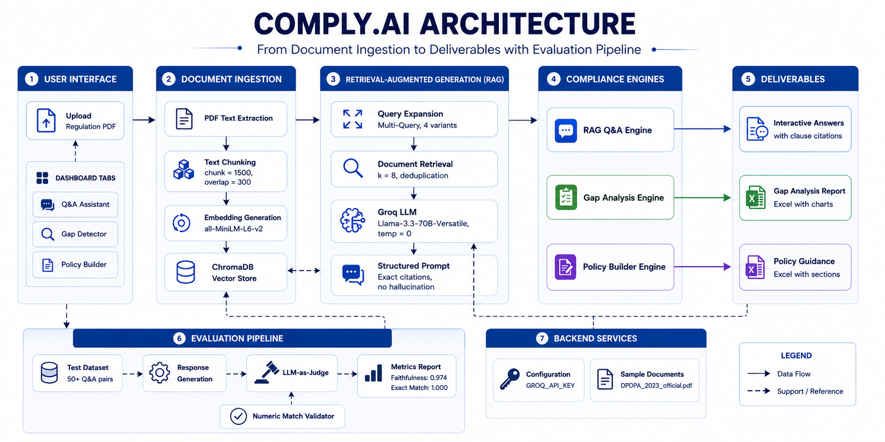

## ⚖️ COMPLY.AI - Regulatory Intelligence & Compliance Assurance System

A universal AI-powered platform for regulatory intelligence, compliance assessment, policy gap detection, and compliance guidance generation.

---

## The Problem

Regulatory compliance has become overwhelmingly complex for businesses.

- Enterprises operate across multiple jurisdictions (India, EU, US, etc.)
- They must comply with overlapping regulations such as **DPDP Act**, **GDPR**, **SEBI**, **RBI**, **SOX**, **CCPA**, and many more
- Keeping up with frequent updates, interpreting legal language, mapping obligations to internal policies, and identifying gaps is time-consuming and expensive
- Most organizations cannot afford continuous external consulting engagements for every regulatory change

**Result:** Delayed compliance, increased risk exposure, regulatory penalties, and reactive governance practices.

---

## The Solution: COMPLY.AI

**COMPLY.AI** is a **universal, regulation-agnostic** AI system that helps organizations understand, analyze, and comply with regulatory requirements more efficiently.

Upload **any regulation PDF**—whether it is the DPDP Act, a SEBI circular, an RBI guideline, GDPR text, SOX requirements, or another regulatory framework—and the system instantly becomes a specialized assistant for that document.

---

## What COMPLY.AI Does

COMPLY.AI enables organizations to:

- Understand complex regulatory documents through natural language interaction
- Analyze internal policies against regulatory requirements
- Identify compliance gaps and associated risks
- Generate tailored compliance guidance and policy recommendations
- Produce audit-ready reports with clause-level traceability

---

## Core Capabilities

### 1. Regulation Q&A

Ask questions about uploaded regulations and receive precise, clause-cited answers grounded in the source document.

### 2. Gap Detector

Upload internal policies or compliance documents and receive:

- Compliance gap analysis
- Severity classifications
- Regulatory rationale
- Actionable remediation recommendations

### 3. Policy Builder

Provide business information in plain English and generate:

- Compliance guidance
- Recommended controls
- Sample policy clauses
- Prioritized action plans

---

## Why COMPLY.AI Stands Out

- **Truly Regulation-Agnostic** — Works with virtually any regulatory PDF
- **Smart DPDP Handling** — Enhanced support for DPDP-specific concepts including Significant Data Fiduciary obligations, children's data requirements, and conditional compliance obligations
- **Improved Retrieval Accuracy** — Multi-query retrieval, intelligent chunking, and optimized prompting reduce hallucinations and improve answer quality
- **Professional Outputs** — Structured Excel reports suitable for internal reviews and audits
- **Modern User Experience** — Interactive dashboards, metrics, and visualizations
- **Lightweight Deployment** — Simple local setup with minimal infrastructure requirements
- **Privacy-Focused** — Documents remain within your environment

---

## Tech Stack

| Component | Technology |
|-----------|------------|
| **Frontend** | Streamlit |
| **LLM** | Groq — Llama 3.3 70B |
| **Framework** | LangChain |
| **Vector Database** | ChromaDB |
| **Embeddings** | all-MiniLM-L6-v2 |
| **PDF Processing** | PyPDF2 + Custom Extractor |
| **Reporting** | openpyxl (Styled Excel Reports) |

---

## Architecture



---

## Project Structure

```bash
comply-ai-lite/
├── app.py
├── core/
│   ├── RAG Engine
│   ├── Gap Analysis Engine
│   ├── Policy Builder
│   └── Vector Store Logic
├── utils/
│   └── Excel Export Utilities
├── data/uploads/
│   └── Temporary Uploaded Files
├── testing/
│   └── Sample Regulations & Policies
├── requirements.txt
└── README.md
```

---

## Quick Start

### 1. Clone the Repository

```bash
git clone https://github.com/adityadev343/comply-ai-lite.git
cd comply-ai-lite
```

### 2. Install Dependencies

```bash
pip install -r requirements.txt
```

### 3. Configure Environment Variables

Create a `.env` file and add your Groq API key:

```env
GROQ_API_KEY=your_api_key_here
```

### 4. Run the Application

```bash
streamlit run app.py
```

---

## How to Use

### Regulation Q&A

1. Upload a regulation PDF
2. Process and index the document
3. Ask natural-language questions such as:

- "What are the breach notification requirements?"
- "What are the obligations of a Significant Data Fiduciary?"
- "Which sections discuss data retention?"

### Gap Detector

1. Upload a regulation
2. Upload your organization's policy document
3. Optionally specify classification details for DPDP-related assessments
4. Generate:

- Compliance score
- Gap analysis report
- Remediation recommendations
- Downloadable Excel report

### Policy Builder

1. Describe your organization and operations
2. Answer business-context questions
3. Generate:

- Compliance guidance
- Sample policy clauses
- Recommended controls
- Priority action roadmap

---

## Key Features

- **Universal Regulation Support** — Works with virtually any regulatory PDF
- **Clause-Level Citations** — Responses reference source clauses directly
- **Actionable Recommendations** — Identifies gaps and suggests remediation steps
- **Conditional Obligation Handling** — Supports regulation-specific logic such as Significant Data Fiduciary classification under DPDP
- **Professional Reporting** — Exportable Excel reports with structured findings
- **Semantic Search + RAG** — Context-aware retrieval for accurate responses
- **Local & Private Processing** — Documents remain under organizational control

---

## License

This project is distributed under the license specified in the repository.
